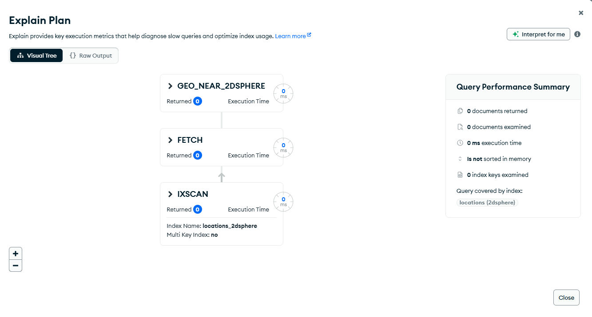
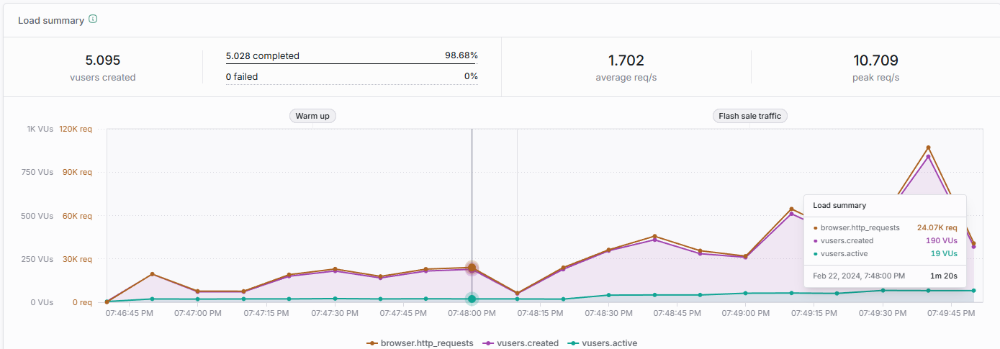
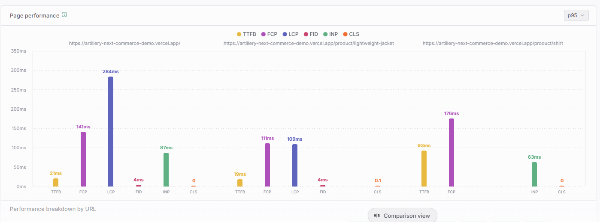
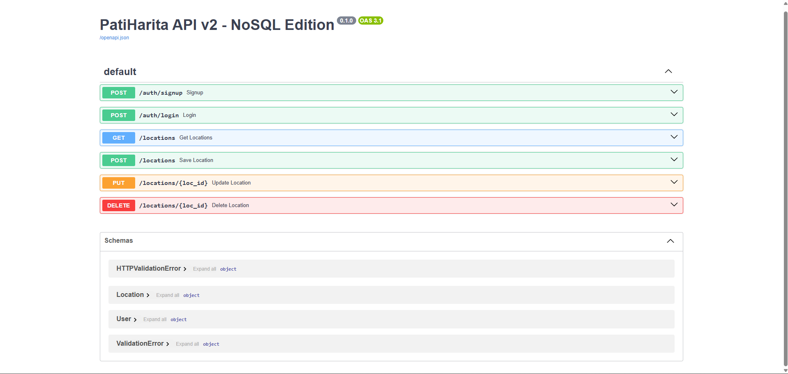
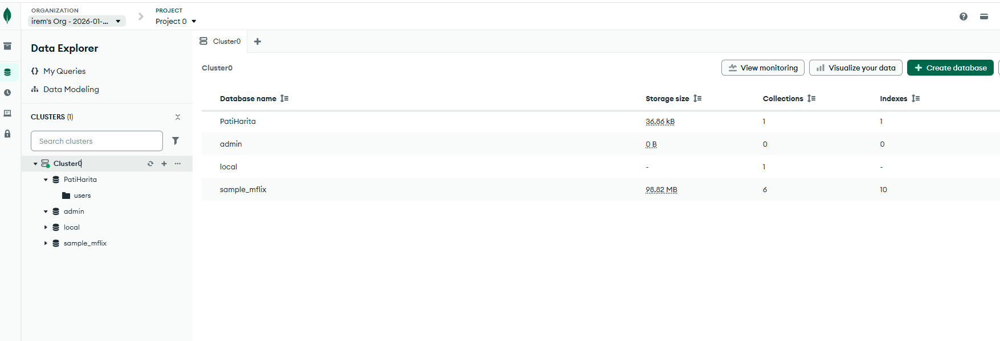

# 🐾 PatiHarita: Coğrafi Bilgi Sistemleri (GIS) ve NoSQL Tabanlı RESTful Mimari

PatiHarita; kentsel ekosistemdeki sokak hayvanlarının refahını artırmak amacıyla, konum tabanlı veri yönetimi sağlayan **Full-Stack NoSQL** bir platformdur.

---

## 📌 Seçilen Maddeler ve Uygulama Özeti (Assignment Items)

Hocanın talebi üzerine, projede uygulanan yönerge maddeleri aşağıda liste halinde sunulmuştur:

* **Managing Different User Types (%20):** Gönüllü, Belediye Yetkilisi ve Yönetici rolleri tanımlanmış, role-based UI ve yetki matrisi uygulanmıştır.
* **NoSQL Database (%25):** MongoDB Atlas kullanılarak heterojen veri yönetimi sağlanmış, SQL ile karşılaştırmalı analizi yapılmıştır.
* **Performance Monitoring & Testing (%25):** Artillery Cloud ile yük/stres testi yapılmış ve grafiklerle raporlanmıştır.
* **Indexing Mechanisms (%25):** `2dsphere` indeksi üzerine bir performans deneyi tasarlanmış ve bulguları dökümante edilmiştir.
* **CRUD Operations (%15):** Coğrafi nokta katmanı için Ekleme, Listeleme, Güncelleme ve Silme yetenekleri sisteme dahil edilmiştir.
* **Authentication (%15):** Kayıt ol / Giriş yap (Sign up/Login) sistemi kurulmuştur.
* **API Development (%25):** FastAPI ile Spatial ve Non-spatial resource ayrımı yapılmış, Swagger UI üzerinden dokümante edilmiştir.

---

## 🏛️ 1. Mimari ve Teknik Derinlik

### A. Neden NoSQL? (Neden MongoDB?)
PatiHarita projesinde veriler heterojen (çok biçimli) bir yapıdadır. 
* **Problem (SQL Yaklaşımı):** "Kayıp İlanı" (tasma rengi, ödül miktarı) ile "Resmi Barınak" (kapasite, veteriner sayısı) verilerini SQL'de yönetmek, ya yüzlerce "Null" değer içeren verimsiz tablolara ya da karmaşık ve yavaş `JOIN` maliyetlerine yol açar.
* **Çözüm (NoSQL Avantajı):** MongoDB'nin döküman tabanlı (BSON) yapısı sayesinde her veri türü, kendi özel alanlarını (Örn: sadece ilanlara has "durum" alanı) performans kaybı yaşamadan esnek bir şekilde saklayabilmektedir.

### B. İndeksleme Deneyi ve Bulgular (Indexing Experiment)
Sistemin ölçeklenebilirliğini ölçmek için `2dsphere` indeksi üzerinde bir performans deneyi yapılmıştır.
* **İndeks Öncesi:** `$near` sorgusu için uygun indeks bulunamadığında veritabanı "unable to find index" hatası vermiş ve işlemi durdurmuştur.
* **İndeks Sonrası (IXSCAN):** `2dsphere` indeksi tanımlandıktan sonra aynı sorgu **1ms** altında (0ms) tamamlanmıştır.

*Kanıt: MongoDB Compass üzerinde yapılan Explain Plan sonucu (IXSCAN kullanımı).*

---

## 👥 2. Kullanıcı Rolleri ve Yetki Matrisi (RBAC)

| Yetki / İşlem | Gönüllü | Belediye Yetkilisi | Yönetici |
| :--- | :---: | :---: | :---: |
| Kayıp İlanı Ekleme | ✅ | ✅ | ✅ |
| Anlık Besleme Bildirimi | ✅ | ✅ | ✅ |
| **Resmi Barınak/Klinik Ekleme** | ❌ | ✅ | ✅ |
| **Veri Silme & Güncelleme (CRUD)** | ❌ | ❌ | ✅ |

---

## 📊 3. Performans ve Stres Testi (Artillery Cloud)

*Artillery Cloud Yük Analizi: 5.000+ kullanıcıda yüksek başarı oranı.*

*Yanıt Süreleri: TTFB ve LCP metrikleri.*

---

## 📸 4. Uygulama Arayüzü ve Sistem Kanıtları

### 🗺️ Genel Harita Görünümü

*Sistemin ana harita arayüzü ve konumsal veri dağılımı.*

### 👤 Role-Based UI (RBAC)
| Yönetici Arayüzü (Admin) | Gönüllü Arayüzü (Volunteer) |
| :---: | :---: |
| .png) | .png) |

### 🛠️ API & Database (Teknik Kanıtlar)

*FastAPI Swagger UI Dokümantasyonu (Spatial & Non-spatial ayrımı).*

*MongoDB Atlas Cloud Veri Yapısı ve Koleksiyon Görünümü.*

---

## 🚀 Çalıştırma Talimatı
1. **Backend:** `cd backend` -> `python -m uvicorn main:app --reload`

2. **Frontend:** `index.html` dosyasını tarayıcıda çalıştırın.

